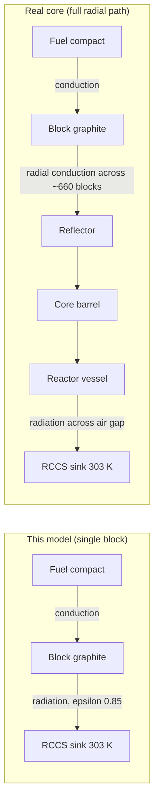

# Peak Fuel Temperature During Passive Cooldown of an HTGR Prismatic Fuel Block

**Prediction report and accuracy assessment**

| | |
|---|---|
| **Project** | HTGR prismatic-block passive cooldown |
| **Prepared for** | Radiant Nuclear |
| **Prepared by** | Samay Shah |
| **Date** | 2026-09-03 |
| **Model** | Single-block conjugate-heat-transfer model (OpenFOAM 7) built with MHTGR-350-class geometry and operating parameters |
| **Reference** | OECD/NEA *Coupled Neutronic/Thermal-Fluids Benchmark of the MHTGR-350 MW Core Design*, NEA/NSC/R(2017)4, a **code-to-code** benchmark, not experimentally validated |
| **Status** | Phase 0 (steady) and Phase 1 (transient verification) complete; Phase LOFC complete (illustrative, block-scale) |

---

## Overview

When forced cooling is lost in a high-temperature gas-cooled reactor (HTGR), the fuel must stay
below the ~1600 °C TRISO/SiC integrity limit on stored heat and passive rejection alone. This
report presents a single-block conjugate-heat-transfer model built using the MHTGR-350's geometry
and operating parameters, and reports what that model predicts for peak fuel temperature during a
loss-of-forced-cooling (LOFC) conduction cooldown under a set of stated assumptions (§4, §6).

**Principal findings:**

1. **The steady baseline is validated-comparable to the benchmark.** On the grid-converged mesh
   the coolant outlet is **688 °C** against the benchmark **687 °C** (**0.2 %**).

2. **The safety-relevant block-scale number is the peak-power column steady/initial-condition
   peak fuel: 1268 °C, margin ≈ 332 °C to the 1600 °C limit.** Run at ×1.85 local power, it
   reproduces the benchmark core-maximum fuel temperature (~1282 °C) to within ~1 %. Within this
   model's scope, it is a bounding estimate.

<!-- 3. **A single block has no delayed peak: it cools from t ≈ 0.** A block radiates directly to the
   Reactor Cavity Cooling System (RCCS) from its own surface, so it sheds stored heat faster than
   decay heat replaces it. In the real core, heat must first conduct radially across ~660 blocks;
   that resistance is what produces the benchmark's 50–74 h delayed peak. This is a scope limit,
   not a modelling error, and it is stated explicitly throughout. -->

<!-- 3. **The methodology is verified.** Steady peak fuel is grid-converged over four meshes
   (apparent order p ≈ 2.15, GCI ≈ 0.95 %). The transient integrator conserves energy to <0.8 %
   for the average column; the peak column closes to 1.84 %, a residual specific-heat
   discretisation effect discussed in §8.3. -->

**In summary:** carry **1268 °C / margin ~332 °C** (peak column) as the block-scale
bounding estimate. Do **not** use the average-column peak (793 °C) as a safety number: it is the
average, not the hot, column. Reproducing the delayed-peak *mechanism and 50–74 h timing* requires
an effective-core radial model, named here as the next-fidelity step (§12).

---

## Nomenclature

| Symbol | Meaning | Units |
|---|---|---|
| `T` | temperature | K or °C |
| `κ(T)` | thermal conductivity (temperature-dependent) | W/m·K |
| `Cp(T)` | specific heat capacity (temperature-dependent) | J/kg·K |
| `ρ` | density | kg/m³ |
| `q‴` | volumetric heat generation rate | W/m³ |
| `h` (enthalpy) | specific sensible enthalpy, `h = ∫Cp dT` | J/kg |
| `α` | thermal diffusivity coefficient in the enthalpy form, `α = κ/Cp` | kg/m·s |
| `τ` | cooldown time constant | s (or min) |
| `ε` | surface emissivity | dimensionless |
| `h_rad`, `h_conv` | radiative / convective heat-transfer coefficient | W/m²·K |
| `A_eff` | effective heat-rejection area | m² |
| `ΔU` | change in stored internal (sensible) energy | J |
| `Q_out` | heat rejected at the outer wall | W |
| `P_decay` | integrated decay power | W |
| `p` | apparent order of grid convergence | dimensionless |
| `βv` | fuel-zone volume-fraction weighting (`betav` in solver) | dimensionless |

**Abbreviations:** CHT conjugate heat transfer · LOFC loss of forced cooling · DCC/PCC
depressurised / pressurised conduction cooldown · RCCS Reactor Cavity Cooling System ·
TRISO tristructural-isotropic fuel · SiC silicon carbide · IC initial condition · BC boundary
condition · GCI Grid Convergence Index · EOEC end-of-equilibrium-cycle · ANS American Nuclear
Society · DIN Deutsches Institut für Normung.

---

## 1. Introduction and background

### 1.1 The question

Passive safety is the central claim of the modular HTGR: on a complete loss of forced cooling,
decay heat is removed by conduction and radiation alone, without operator action or active
systems, and the fuel stays intact. "Intact" means the TRISO particle's SiC layer is never driven
above ~1600 °C. This report estimates that margin at the fuel-block scale:

> *When forced cooling is lost, how hot does the fuel of an MHTGR-350 prismatic block get, and how
> much margin remains to the 1600 °C limit?*

### 1.2 The reactor and the reference

The MHTGR-350 is a 350 MW(t) prismatic-block HTGR with helium coolant at 6.39 MPa, core inlet
259 °C and outlet 687 °C. Fuel is contained in cylindrical compacts pressed into a hexagonal
H-451 graphite block (36 cm across-flats), with parallel coolant channels; ten blocks stack to the
7.93 m active height.

The external reference is the **OECD/NEA MHTGR-350 benchmark** (NEA/NSC/R(2017)4). It is a
**code-to-code** exercise: its published reference results come from PHISICS/RELAP5-3D, and the
benchmark authors explicitly caution that the transient event sequences *"should not be seen as
representative of the MHTGR safety case but purely as the basis for code-to-code comparisons."*
Consequently, **"validation" in this report means agreement with the reference codes, not with
measured reality.** All benchmark values and their provenance are catalogued in
[`benchmark/README.md`](benchmark/README.md).

### 1.3 What this model resolves

This model resolves **one prismatic fuel block / one coolant-channel column** (extruded to the
full 8 m / 10-block active height), *not* the full annular core. That single scope decision governs
how every result must be read, and §2 addresses it.

---

## 2. Scope and reading guide

This model resolves one block/column, not the annular core, built from the MHTGR-350 geometry and
operating parameters under the assumptions in §4 and §6.

### 2.1 Two power levels

The model is run at two power levels because no single column serves both jobs: the average-power
column matches the benchmark's core-average operating point for validation, while the hottest column
carries about 1.85× that power and is where the peak fuel and least margin actually occur. Every
peak-fuel result belongs to one of them:

- **Average-power column:** the block-average power density. Anchors the steady baseline against the
  benchmark operating point; being the average and not the hottest column, it under-predicts the
  core peak.
- **Peak-power column (×1.85 local power):** the hot column. This is the safety-relevant case and
  the source of the bounding number.

### 2.2 What this model does not cover

Because it is a single block, this model reports the peak at and near the initial condition and the
conduction cooldown that follows; it does not represent the whole-core radial conduction that sets a
delayed, core-wide peak.

---

## 3. Methodology

### 3.1 Code

OpenFOAM 7 with a **custom temperature-based conjugate-heat-transfer solver**,
`chtMultiRegionTFoam` (vendored in [`solver/`](solver/)).

**Why temperature-based** The stock `chtMultiRegionFoam`
solves the solid in enthalpy, `∂(ρh)/∂t = ∇·(α∇h)` with `α = κ/Cp`. It inserts `Cp` as a *nodal*
value inside `α` but as an *interval-mean* inside `∇h`; the two cancel only for constant `Cp`,
leaving a **mesh-independent bias (~17 °C in prior work) in the steady temperature field.** The
T-solver solves

```
ρ·Cp(T)·∂T/∂t = ∇·(κ(T)·∇T) + q‴
```

directly, so **steady conduction (`∇·(κ∇T) + q‴ = 0`) is `Cp`-independent**, and
`Cp(T)` enters *only* the transient inertia term, where it physically belongs. Under a `steadyState`
scheme the ddt term is identically zero and the steady result carries no `Cp` dependence at all.

<!-- The exact discrete form, taken verbatim from
[`solver/chtMultiRegionTFoam/solid/solveSolid.H`](solver/chtMultiRegionTFoam/solid/solveSolid.H):

```cpp
fvScalarMatrix TEqn
(
    fvm::ddt(betav*rho*cp, T)
  - fvm::laplacian(betav*kappa, T, "laplacian(alpha,h)")
  ==
    betav*Q            // volumetric fission/decay heat [W/m^3]
);
``` -->

### 3.2 Geometry and mesh

A single MHTGR-350-class prismatic block cross-section, generated with gmsh
([`geometry/make_full_block.py`](geometry/make_full_block.py)) and extruded along the flow
axis to the full active core height. A hexagonal H-451 graphite prism carries a triangular lattice
of holes at 18.8 mm pitch; coolant channels occupy the √3×√3 sublattice (one-third of the sites),
leaving a 2:1 fuel-to-coolant hole ratio representative of a real block.

| Parameter | This model | Benchmark (NEA/NSC/R(2017)4) |
|---|---|---|
| Across-flats | 0.36 m | 36 cm |
| Hole pitch (triangular) | 18.8 mm | 1.8796 cm |
| Fuel compact radius | 6.2 mm (Ø 12.4 mm) | 0.635 cm |
| Coolant channel radius | 8.0 mm (Ø 16 mm) | 0.794 cm large / 0.635 cm small |
| Fuel : coolant holes | 2.04 : 1 (222 fuel / 109 coolant) | 2 : 1 |
| Area fractions (fuel / coolant / graphite) | ~23 % / ~19 % / ~58 % | porosity 0.186 |
| Column length (active height) | 8.0 m (10-block) | 7.93 m (10 × 79.3 cm) |

The fuel compacts are a **heat-source cellZone** inside one uniform H-451 graphite region (no
distinct compact or gap conductivity, §5.2). Omitted: the 3.5 cm fuel-handling hole, the six corner
lumped-burnable-poison holes, and bypass-flow gaps (§6).

**Mesh.** 109 resolved coolant channels and 222 fuel holes, with graded near-wall refinement on the
channel walls. A four-mesh family spanning ~8× in cell count drives the grid study (1.14 M to
9.15 M cells): the reported Phase-0/LOFC results use the grid-converged **9.15 M** mesh, while the
earlier **2.64 M** medium mesh (solid 1.83 M, fluid 811 k) under-resolves the peak by ~17 °C and is
retained only for the Δt study (§8.2, §8.4).

### 3.3 Phases

| Phase | Physics | Purpose |
|---|---|---|
| **0: Steady State** | two-region CHT: resolved helium channels ↔ solid, marched as a `steadyState` pseudo-transient to convergence | establish agreement where reference data exists |
| **1: Transient Verification** | time-accurate transient | prove the time-integration conserves energy before trusting the cooldown |
| **LOFC (conduction cooldown)** | **solid-only** conduction + time-dependent decay heat + radiative RCCS rejection | the block-scale accident calc |

**Steady (Phase 0).** Two-region conjugate heat transfer marched as a `steadyState`
pseudo-transient; peak fuel plateaus by ~350 iterations, and the run is stopped on a converged
write.

**Passive cooldown (Phase LOFC).** **Solid-only** conduction. Forced cooling is lost and the
primary is depressurised/stagnant, so the in-channel helium is thermally inert and dropped; the
channels become adiabatic walls. The solve is time-accurate (implicit Euler, physical seconds) from
the Phase-0 field with a time-dependent decay-heat source. Dropping the fluid removes the pressure
equation entirely.

### 3.4 LOFC Solid Only Modeling Rationale

Treating the channels as adiabatic (§3.3) is a **conservative** choice. Stagnant helium would
carry a little heat out of the block, so trapping it over-predicts the peak rather than under-predicts
it. Dropping the fluid also removes the pressure equation, which avoids a sealed-channel fluid
model that is ill-posed due to singularity. The modelled case is
thus the depressurised/stagnant cooldown.

### 3.5 Verification instrumentation

The transient integrator is verified with an **in-solver energy monitor** that emits, each solid
solve, the exact solver-side terms of the conservation identity `d(∫ρh)/dt = P_decay − Q_out`:

- `U = ∫ρh dV`: total sensible enthalpy [J]
- `Pdec = ∫Q dV`: decay power in [W]
- `Qout = ∮ −κ·∇T·n dA` over the outer wall: conductive flux out = radiated [W]

These are appended as `ENERGYMON` lines to the log and reconciled in post-processing (see §8.1 and
Appendix A).

---

## 4. Boundary conditions

### 4.1 Steady state (normal operation)

| Surface | Condition | Rationale |
|---|---|---|
| Coolant inlet | `fixedValue` T = 259 °C (532.15 K); U = 18.8 m/s | benchmark core inlet; velocity from mass flow (§5.1) |
| Coolant outlet | `inletOutlet` / `pressureInletOutletVelocity` | free outflow |
| Fluid ↔ solid interface | coupled (`turbulentTemperatureCoupledBaffleMixed`) | conjugate heat transfer, T + κ exchanged |
| Outer radial wall | **adiabatic** (`zeroGradient`) | interior-column symmetry (neighbours ≈ same T in normal op) |
| Axial ends | **adiabatic** (`zeroGradient`) | approximation of negligible axial end loss; in normal op axial transport is coolant-advection-dominated, so the net flux reaching the top/bottom faces is a minor term. Beyond the faces lie the axial graphite reflectors (more graphite at similar T), so any real end loss is small and adiabatic slightly over-traps (mildly conservative) |

### 4.2 Passive cooldown (LOFC)

| Surface | Condition | Rationale / caveat |
|---|---|---|
| Coolant channels | **adiabatic** (`zeroGradient`); helium inert/dropped | forced cooling lost; conservative (traps heat) |
| Axial ends | **adiabatic** | as in steady |
| Outer radial wall | **radiation to RCCS**: `externalWallHeatFluxTemperature`, ε = 0.85, T_amb = 303 K (30 °C RCCS sink), h = 1×10⁻³ | Once FC is lost, the only way the block can shed heat with via RCCS. Nonconservative, a full-core model in the benchmark has a RCCS placed at the reactor vessel boundary. Heat from the fuel block must traverse a large series resistance to reach the sink.  |

**Boundary Condition Biases**

1. **Radiation applied at the block surface collapses the entire radial resistance of the core**
   (reflector + core barrel + reactor vessel + stagnant-air gap) to zero. The benchmark's RCCS
   values (303 K, ε 0.85/0.74, stagnant-air radiation, 122.5 cm from the vessel) belong at the
   vessel boundary of a full-core model, not on a fuel block. Placing them on the block makes it
   shed heat far too easily, so the block shows no delayed peak (§2.2).

2. **h = 1×10⁻³ is a numerical floor, not a physical convection coefficient.** The BC forms `1/h`,
   so h = 0 (pure radiation) divides by zero; radiation dominates the floor by ~10⁴ : 1, so the
   wall is effectively radiation-only. 

---

## 5. Inputs

All benchmark values trace to NEA/NSC/R(2017)4 (page/table cited where relevant); see
[`benchmark/README.md`](benchmark/README.md).

### 5.1 Operating point

| Input | Value | Source / derivation |
|---|---|---|
| Coolant | Helium, perfect gas, Cp 5193 J/kg·K | spec §AIV.13 |
| Primary pressure | **6.39 MPa** | spec p.16 (sets He density via EoS) |
| Core inlet temperature | **259 °C (532.15 K)** | spec p.16 |
| Inlet velocity | **≈ 18.8 m/s** | ṁ = 157.1 kg/s ÷ (109 channels × ~66 columns) → per-channel ṁ / (ρ·A_ch); cross-checked against the core energy balance |
| Power density (average) | 5.93 MW/m³ block-avg → **24.83 MW/m³** on the fuel zone | 5.93 / fuel volume fraction 0.2389 |
| Power density (peak column) | 11 MW/m³ block-avg (block 13 / level 8, ×1.85) → **46.05 MW/m³** on the fuel zone | radial × axial peaking |

### 5.2 Materials (H-451 graphite; benchmark verbatim where possible)

| Property | Value | Source | 
|---|---|---|
| Density ρ | **1850 kg/m³** | Table AIV.3 |
| Emissivity ε | **0.85** | Table AIV.3 | 
| Specific heat Cp(T) | benchmark polynomial (T⁻¹…T⁻⁴ terms), **refit** to a positive-power poly for OpenFOAM (`hPolynomial`), max error **0.28 %** over 350–1900 K | Table AIV.3 | 
| Conductivity κ(T) | **un-irradiated** fit: `κ = 3.28248e-5·T² − 0.124890·T + 169.2145` W/m·K | Table AIV.2 (un-irradiated row) | 

The compact matrix and gap are **not** modelled with distinct conductivities (fuel is a
heat-source zone in uniform graphite); this is a modest approximation for thermal inertia (~2 °C in
prior work).

### 5.3 Decay heat (LOFC case)

| Input | Value | Source | 
|---|---|---|
| Form | `q‴(t) = q‴_op · f_decay(t)`, spatially uniform on the fuel zone, clock from t = 0 | benchmark §I.7.4 (decay ∝ steady local power) | 
| f_decay(t) | **ANS-5.1-family** standard U-235 decay-heat curve, tabulated from published decay fractions | standard shutdown decay | 
| q‴_op | 24.83 MW/m³ (average) or 46.05 (peak column) | §5.1 | 

---

## 6. Assumptions

1. **Single block / single column**, not the annular core. 

2. **Adiabatic lateral walls in steady** (interior-column symmetry); **radiation-to-RCCS at the
   block surface in the LOFC case** (lumped surrogate, non-conservative).
3. **Both average and peak columns run** (peak = ×1.85 power); the average column validates the
   outlet, the peak column reaches the benchmark core-max fuel temperature.
4. **Un-irradiated κ(T)** (irradiated data and the fluence file were not available in the
   distributed benchmark materials).
5. **ANS-5.1-family decay** anchored to the standard's published fractions.
6. **Uniform-in-z power** (no axial power shape, which is why average and peak power cases were run).
7. **Fuel as a heat-source zone in uniform H-451** (no distinct compact/gap conductivities).
8. **Fixed post-blowdown pressure**; the 0–20 s depressurisation transient is not modelled.
9. **No control rods, no lumped burnable poison, no fuel-handling hole**, no bypass-flow gaps.
10. **PCC (pressurised cooldown) excluded**: its convective/recirculation mechanism is core-scale.

---

## 7. Results

### 7.1 Steady state (normal operation)

| Quantity | This model (grid-converged) | Benchmark reference | Agreement |
|---|---|---|---|
| Coolant outlet (area-avg) | **688 °C** | 687 °C (core-average) | **0.2 %, comparable** |
| Peak fuel (average column) | **≈ 799 °C** (Richardson; 793 °C on the 9.15 M mesh, GCI ~1 %) | n/a (core max is a *peak*-column quantity) | see discussion below and §8.4 |
| Peak fuel (peak column, ×1.85) | **1268 °C** | ~1282 °C (core max) | **~1 %** |

The widely-cited benchmark steady peak fuel **~1282 °C** is the *core maximum*: the hottest
1/6-block in the hottest (peak-power) column. Our **average-power** column peaks lower
(793 °C ≈ outlet 688 °C + fuel-to-coolant ΔT ~105 °C), which is physically consistent. The
**peak-power column** run (×1.85 → 46 MW/m³ fuel-local, fine mesh) reaches **1268 °C**, reproducing
the benchmark core max to within ~1 %. Its coolant outlet (~1050 °C) is *not* benchmark-comparable:
×1.85 power at the same channel flow heats the coolant ~1.85×, whereas in the real core the peak
column is orificed to higher flow.

### 7.2 Passive cooldown: the LOFC case

Run on the grid-converged 9.15 M-cell mesh, with the initial condition taken as the converged
Phase-0 field.

| Quantity | Average column | Peak column (×1.85) |
|---|---|---|
| **Peak fuel (max over space and time)** | **≈ 793 °C** at *t ≈ 0* | **1268 °C** at *t ≈ 0* |
| **Margin to TRISO limit (1600 °C)** | **≈ 807 °C** | **≈ 332 °C** |
| Behaviour after t = 0 | monotonic conduction cooldown | monotonic conduction cooldown |
| Quasi-steady floor | ~270 °C over ~8 h | ~367 °C |
| Cooldown time constant τ | ~94 min (63 %) to ~121 min (log-fit) | ~59–108 min |
| Peak location | block centre, hot (outlet) end | block centre, hot end |
| Transient energy closure (Phase 1) | 0.80 % imbalance, PASS | 1.84 % (see §8.3) |

**The peak is the initial condition.** When forced cooling is lost, fission power drops to ~6 %
decay heat *instantly*, and the block radiates its stored heat to the RCCS sink faster than decay
replaces it, so it cools from the start. This is the block-scale behaviour described in §2: the
model reports the peak at the initial condition and the conduction cooldown that follows.

---

## 8. Verification: 


### 8.1 Transient energy conservation

The in-solver monitor (§3.5, Appendix A) tests `ΔU = ∫P_decay dt − ∫Q_out dt` with every term
evaluated solver-exact.

| Case / step | Imbalance | Status |
|---|---|---|
| Average column, Δt 100 s | **0.08 %** | Pass |
| Average column, Δt 50 s | **0.24 %** | Pass |
| Average column, 9.15 M mesh | **0.80 %** | Pass |
| Peak column | **1.84 %** | ⚠️ marginally > 1 % (see §8.3) |

The monitor cross-checks three independent ways and they agree: the solver's `∫ρh` change
(−584 MJ), an independent full-field enthalpy integration (−584 MJ), and the decay-minus-radiation
budget.

### 8.2 Time-step independence

Peak fuel is identical at both time steps (778.0 °C, medium-mesh Δt study) and the stored-energy
change ΔU matches to 0.05 %. ✅ PASS.

### 8.3 The peak-column 1.84 % closure: a residual Cp discretisation effect

This residual lives in the transient inertia term. The solver advances a step as
`ρ·Cp(T*)·(T_new − T_old)`, evaluating `Cp` at a single point `T*`, whereas the true internal-energy
change is `ρ·∫Cp dT` over `[T_old, T_new]`. The two agree only if `Cp` is constant across the step;
when `Cp` curves, `Cp(T*)·ΔT ≠ ∫Cp dT`, an error that grows with the per-step ΔT and the curvature
of `Cp(T)`. That is why it stays <0.8 % for the average column but reaches 1.84 % for the peak
column, whose 1268 → 367 °C swing is steepest at t ≈ 0. The reported peak (1268 °C) is unaffected:
it is the exact steady initial condition, so only the cooldown trajectory carries the residual.

**Next step.** Replace the transient term with an enthalpy form, `ρ·(h(T_new) − h(T_old))/Δt`, which
converges to an exact energy balance regardless of step size while retaining the T-form `∇·(κ∇T)`
for conduction (preserving the `Cp`-independent steady result). A smaller Δt near t = 0
suppresses the same error.

### 8.4 Steady grid-independence study

Four 8 m-column meshes spanning ~8× in cell count (Phase-0, average column):

| Mesh | Cells | Peak fuel | Δpeak | Coolant outlet | Gap to benchmark 687 °C |
|---|---|---|---|---|---|
| Coarse | 1.14 M | 772.3 °C | n/a | 666.7 °C | −20.3 |
| Medium | 2.64 M | 781.9 °C | +9.6 | 676.3 °C | −10.7 |
| Fine | 6.14 M | 791.1 °C | +9.2 | 685.5 °C | −1.5 |
| **Finest** | **9.15 M** | **793.1 °C** | **+2.0** | **688.2 °C** | **+1.2** |

- **The peak fuel is grid-converged.** The first three meshes drift ~9–10 °C/level, but the **finest-mesh increment collapses to +2.0 °C**, and
  normalised per unit refinement the increment roughly halves, so it shrinks faster than the step. A Roache GCI on the asymptotic triplet (medium/fine/finest, unequal ratios) gives
  **apparent order p ≈ 2.15**, **GCI = 0.95 %** on the
  finest mesh, and a **Richardson-extrapolated grid-converged peak of ≈ 799 °C** (Appendix B).
- **Independent cross-check:** the coolant outlet converges to **688.2 °C**, within **0.2 %** of the
  benchmark 687 °C (gaps collapse −20 → −11 → −1.5 → +1.2).

- The medium mesh (782 °C) **under-resolves the peak by
  ~17 °C** versus the grid-converged value, so the LOFC case was re-run from the grid-converged
  (9.15 M) Phase-0 field (IC ~793 °C). **Best estimate: steady peak fuel ≈ 799 °C** (Richardson) /
  793 °C on the finest mesh, GCI ~1 % (±~7 °C); **margin ≈ 807 °C** to the TRISO limit. This is a
  *steady-state, average-column* value.

### 8.5 Cooldown time constant check

The fitted CFD cooldown time constant (~121 min, log-fit) agrees with the analytic
lumped-capacitance estimate `τ = ρc·V/(h_rad·A)` ≈ 128 min to within ~5 %. 
---

## 9. Validation and benchmarking: *is it the right physics?*

Strictly, **validation** means comparison against **experimental** reality with quantified
uncertainty (ASME V&V 10/20). This benchmark is **code-to-code**, so agreement with it is
**benchmarking** (cross-code comparison), not validation in the formal sense: it establishes that
this model agrees with PHISICS/RELAP5-3D, neither of which is itself validated against measured
data. The evidence below is therefore organised in two parts: what agrees with the reference codes
(§9.1) and independent physical-consistency checks that raise confidence beyond a single number
(§9.2).

### 9.1 Benchmarking evidence (agreement with the reference codes)

| Metric | This model | Benchmark | Assessment |
|---|---|---|---|
| Steady coolant outlet | 688 °C | 687 °C | **comparable (0.2 %)**, the directly tabulated benchmark quantity |
| Steady peak fuel (peak column) | **1268 °C** | **~1282 °C** (core max) | **comparable (~1 %)**, reproduces the benchmark core max |
| Steady peak fuel (avg column) | ~793 °C (Richardson ~799) | ~1282 °C is the *core max* (peak column) | consistent for an average column, not a direct match |
| LOFC-case peak fuel(t) | ~793 °C @ t≈0, then cools | N/A | N/A |

Two independent observables agree (outlet 0.2 %, peak-column max ~1 %), which is stronger than
either alone since they constrain different physics (coolant enthalpy rise vs peak conduction).

### 9.2 Physical-consistency and sub-model checks


- **Global steady energy balance:** core power in vs coolant enthalpy rise closes to <1 %
  (Phase 0), independently confirming the fluid/solid coupling, not just the endpoint temperatures.
- **Fuel-to-coolant ΔT decomposition:** the average-column peak (793 °C) resolves as outlet
  688 °C + a fuel-to-bulk rise of ~105 °C, the physically expected magnitude for the resolved
  channel heat-transfer coefficient. 
- **Decay-heat sub-model:** anchored to the ANS-5.1 published decay fractions (§5.3), i.e. the
  source term is validated against a standard rather than fitted to the answer.
- **Cooldown time constant:** CFD τ ~121 min against the analytic lumped-capacitance estimate
  ~128 min (~5 %, §8.5), a limiting-case check on the transient.


---

## 10. Directional bias of the block-scale LOFC prediction

| Assumption | Effect on predicted peak |
|---|---|
| Adiabatic channels (no coolant heat removal) | **conservative** (over-predicts) |
| **Radiation to RCCS at the block surface** (no core radial resistance) | **strongly non-conservative** (under-predicts), dominant |
| Un-irradiated κ (higher than irradiated) | **non-conservative** (under-predicts; irradiation lowers κ → hotter) |


---

## 11. Uncertainty and limitations

Numerical uncertainties are quantified below. Model-form limitations are directional: their sign is
known (§10), but the magnitude is not propagated into a single combined band.

| Source | Type | Effect / magnitude | Status / next step |
|---|---|---|---|
| Single-block scope (no core radial conduction path) | limitation | Model cools from its initial condition and does not produce the whole-core delayed peak; the result is block-scale only | Effective-core radial model (§12) |
| Radiation-to-RCCS at the block surface | model form (BC) | Collapses the core radial resistance; non-conservative for the cooldown trajectory (§4.2, §10) | Move the RCCS boundary to the vessel in a full-core model (§12) |
| Un-irradiated κ(T) | model form | Biases the peak low (irradiation lowers κ); sign known, magnitude not quantified | Irradiated Table AIV.2 coefficients + EOEC fluence |
| Uniform axial power (no axial shape) | model form | Affects peak location and magnitude; partly addressed by running both power levels | Apply the benchmark axial power profile |
| Fuel as a heat-source zone in uniform graphite (no compact/gap κ) | model form | Small thermal-inertia effect (~2 °C, prior work) | Model distinct compact/gap conductivities if needed |
| Peak-column transient energy closure | numerical | 1.84 % over the cooldown; does not affect the reported peak (§8.3) | Enthalpy-form ddt, or smaller Δt near t = 0 |

---

## 12. Recommended next-fidelity step

The block's peak is at t ≈ 0 because it radiates straight to the RCCS from its own outer surface. In
the real core, decay heat must first conduct *radially across ~660 blocks* to reach the reflector,
vessel and RCCS, and that radial resistance is what produces the benchmark's delayed peak tens of
hours in. The two heat-rejection paths differ by everything that sits between the fuel and the sink:



To predict the safety-relevant delayed peak, the model must restore that radial path:

- an **effective-core radial model** (or full annular core) with the RCCS boundary at the **reactor
  vessel** surface (303 K, ε 0.85/0.74, stagnant-air radiation, 122.5 cm gap, the benchmark
  values recorded in [`benchmark/README.md`](benchmark/README.md)), against the benchmark
  targets **1391 K @ 50 h** (block) / **1237 K @ 74 h** (ring).

The verified block model, its comparable steady baseline, and the verified transient integrator are
the starting point for that step.

---

## 13. Conclusions

The single-block model reproduces the benchmark's steady operating point: the grid-converged coolant
outlet is 688 °C against the reference 687 °C (0.2 %), and the steady peak fuel is grid-converged
over four meshes (apparent order p ≈ 2.15, GCI ~1 %, about ±7 °C). The transient integrator
conserves energy to within 0.8 % for the average column and 1.84 % for the peak column; the latter
is a specific-heat discretisation effect in the time term (§8.3) and does not affect the reported
peak.

The peak-power column gives a steady/initial-condition peak fuel of 1268 °C and a margin of ~332 °C
to the 1600 °C TRISO limit, reproducing the benchmark core-maximum fuel temperature (~1282 °C) to
within ~1 %. Within the scope of this model it is the bounding estimate. The average-power column
peaks near 793 °C; it validates the operating point but is not a safety figure, being the average
rather than the hottest column.

The model is limited to a single block. It reports the peak at the initial condition and the
conduction cooldown that follows, and does not represent the whole-core radial conduction that
produces a delayed, core-wide peak. Quantifying that peak requires a full-core or effective-core
radial model, described in §12 as the recommended next step.

---

## Appendix A. Energy-monitor formulation

The Phase-1 monitor (embedded in
[`solver/chtMultiRegionTFoam/solid/solveSolid.H`](solver/chtMultiRegionTFoam/solid/solveSolid.H))
writes, each solid solve, the exact solver-side terms of the transient conservation identity

```
d(∫ρh dV)/dt = P_decay − Q_out
```

| Term | Definition | Discrete evaluation |
|---|---|---|
| `U` | `∫ρh dV` (total sensible enthalpy, J) | `gSum(rho·h·Vc)` |
| `Pdec` | `∫Q dV` (decay power in, W) | `gSum(Q·Vc)` |
| `Qout` | `∮ −κ·∇T·n dA` over `outerWall` (radiated out, W) | `−gSum(κ·snGrad(T)·magSf)` on the patch |

Each line is emitted as `ENERGYMON <time> <U> <Pdec> <Qout>` and de-duplicated by time in
post-processing. The imbalance quoted in §8.1 is
`|ΔU − ∫(Pdec − Qout) dt| / |∫Pdec dt|` over the integration window. Because `U` is built from the
enthalpy field while the equation is advanced on `T` with a pointwise `Cp` (§8.3), this imbalance
is also the direct measure of the ddt-versus-enthalpy discretisation mismatch.

## Appendix B. Grid-convergence (Roache GCI)

Applied to the asymptotic triplet (medium 2.64 M / fine 6.14 M / finest 9.15 M; unequal refinement
ratios) for the average-column steady peak fuel:

- Apparent order **p ≈ 2.15** (near second-order).
- **GCI = 0.95 %** on the finest (9.15 M) mesh, i.e. grid uncertainty ~±7 °C on the ~793 °C peak.
- **Richardson-extrapolated peak ≈ 799 °C.**
- Independent cross-check: coolant outlet converges to 688.2 °C, within 0.2 % of the benchmark
  687 °C; the benchmark gap collapses monotonically −20.3 → −10.7 → −1.5 → +1.2 °C across the four
  meshes.

## Appendix C. Provenance

Results produced with `chtMultiRegionTFoam` (OpenFOAM 7) on the 8 m / 10-block column. Phase 0
steady grid-converged over four meshes (1.14–9.15 M cells); average- and peak-column (×1.85)
Phase-0 runs; Phase LOFC transient run to 30 000 s (8.3 h) with ANS-5.1-family decay, energy
conservation verified in-solver, Δt-independence checked. Benchmark data and page cites in
[`benchmark/README.md`](benchmark/README.md); V&V plan in
[`docs/validation_plan.md`](docs/validation_plan.md).

## References

1. OECD/NEA, *Coupled Neutronic/Thermal-Fluids Benchmark of the MHTGR-350 MW Core Design*,
   NEA/NSC/R(2017)4, benchmark spec (geometry, steady conditions, decay-heat appendix).
   <https://www.oecd-nea.org/upload/docs/application/pdf/2020-01/dir1/nsc-r2017-4.pdf>
2. G. Strydom et al., INL, *MHTGR-350 DCC/PCC (Ex. II-1a / II-2) transient reference results*
   (PHISICS/RELAP5-3D), source of the delayed-peak numbers (1391 K @ 50 h block / 1237 K @ 74 h
   ring). <https://inldigitallibrary.inl.gov/content/uploads/50/2026/04/7146952.pdf>
3. OSTI-1248189, *MHTGR-350 steady multiphysics results*: block/ring axial fuel-temperature
   profiles. <https://www.osti.gov/pages/servlets/purl/1248189>
4. Steady peak-fuel value (~1282 °C), cited in the multi-physics steady-state and thermo-fluid
   verification papers (paywalled; treated as a reference band, not a certified digit; see
   [`benchmark/README.md`](benchmark/README.md) §2).
